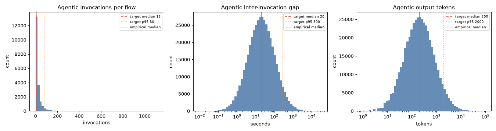
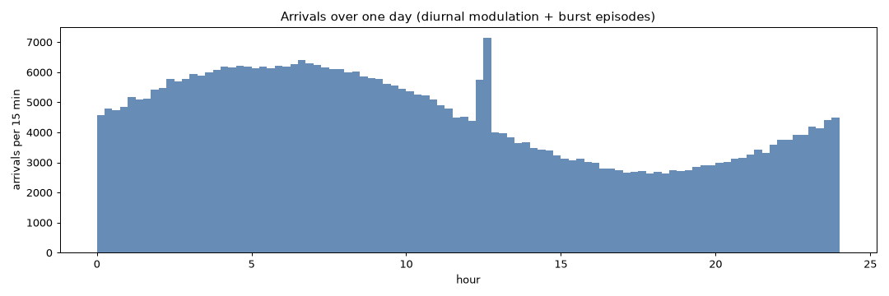
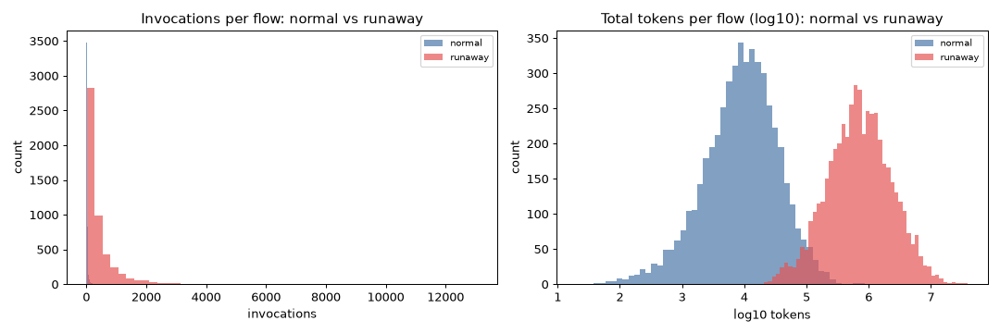

# SG2 Workload Validation Report

Auto-generated by `make validate` (sim/workload/validate.py). Validates the
spec Section 5 generators. House style: hyphens only (D-026).

## 1. Flow-structure distributions (agentic class, direct sampling)

Sampled 20000 agentic flows. Empirical median/p95 vs the spec targets:

| quantity | emp median | target median | emp p95 | target p95 | n |
|----------|-----------:|--------------:|--------:|-----------:|--:|
| invocations per flow | 12.0 | 12 | 79.0 | 80 | 20000 |
| inter-invocation gap (s) | 20.0 | 20 | 300.1 | 300 | 441557 |
| output tokens per step | 200.0 | 200 | 1992.0 | 2000 | 461557 |

## 2. Traffic mix (by token volume)

- Target agentic token share: **0.3**
- Achieved agentic token share: **0.298**
- Flow counts: {'interactive': 433721, 'agentic': 2687}  (agentic flows are rare because each
  carries far more tokens than an interactive turn -- the mix is by token
  volume, not by flow count).

## 3. Arrival process (Poisson + diurnal + bursts)

- Mean arrival rate: **5.051/s** (config base 5.0/s;
  diurnal averages to ~1, bursts lift the mean slightly).
- Per-15-min arrival counts range 2636-7151
  across the day (diurnal swing + burst spikes visible below).

## 4. Adversarial family (demonstrably runaway)

- Invocations per flow: runaway median **240** vs normal **12** (20x).
- Total tokens per flow: runaway median **700210** vs normal **9560** (73x).
- Injection at target 0.106 of agentic arrivals flagged runaway (config-driven).

## 5. Reproducibility

- Same seed, two runs -> identical hash: **True**
  (`f024b06c9fcb9d8f...`)
- Different seed -> different hash: **True**

